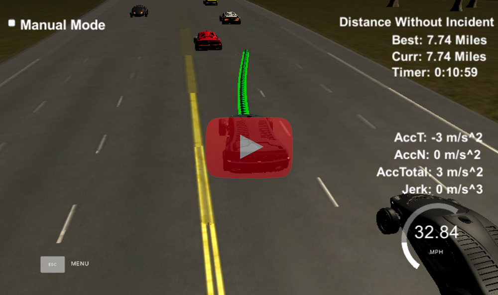

# Path Planning Project Udacity Self Driving Car

The video above shows the car efficiently navigating traffic. The car will always look for lanes that provide maximum speed. In high traffic situations, the planner looks ahead in the current and intended lane and tries to find wide open lanes vs lanes with cars just out of range of the main car's projected path. I'm impressed to see that the car can effectively plan and execute a 2 lane change while staying within acceleration limits.

### Goals
Safely navigate around a virtual highway with other traffic that is driving +-10 MPH of the 50 MPH speed limit. Given the car's localization and sensor fusion data, there is also a sparse map list of waypoints around the highway. The car should try to go as close as possible to the 50 MPH speed limit, which means passing slower traffic when possible, note that other cars will try to change lanes too. The car should avoid hitting other cars at all cost as well as driving inside of the marked road lanes at all times, unless going from one lane to another. The car should be able to make one complete loop around the 6946m highway. Since the car is trying to go 50 MPH, it should take a little over 5 minutes to complete 1 loop. Also the car should not experience total acceleration over 10 m/s^2 and jerk that is greater than 10 m/s^3.

#### File Structure

- `main.cpp` entry point that read messages from the simulator and plots a trajectory for a given state
- `utils.cpp`  moved some functions from `main.cpp` and sensor fusion functions
- `vehicle.cpp` finite state machine and trajectory generation code
- `cost.cpp` cost function

#### Splines
The spline library is used to plot a path for the car. It starts with two points taken from the car's current position or last 2 points of the previous path. Then 3 more points are positioned at 30, 60 and 90 meters ahead. These points provide a smooth path that doesn't violate the accelerations constraints. The spline is sampled for a given lane and reference speed and 50 waypoints are plotted for the car to follow.

The spline generation can be found in `main.cpp` on lines 119-157.

#### Finite State Machine
The finite state machine determines which successor states are possible given the main car's current state. The states are:

 - Keep Lane (KL)
 - Prepare Lane Change Left/Right (PLCL/PLCR)
 - Lane Change Left/Right (LCL/LCR)

The finite state machine is in `vehicle.cpp` on lines 51-78.

#### Sensor Fusion
Sensor fusion data is used to generate a prediction for every vehicle in the data set and stored in a `Vehicle` object. The planner will use these predictions to make decisions about when to make lane changes and avoid collisions.

Predictions are generated from sensor fusion data in `utils.cpp` on lines 140-158.

#### Path Planning
The main vehicle starts out in the default Keep Lane state and slowly accelerates. The main car either travels at the maximum allowed speed or tracks the speed of the leading car in it's lane.

The `PLCL/PLCR` states evaluate the next lane's speed and check for possible collisions if another vehicle is predicted to be in the position of the main car during the lane change.

The `LCL/LCR` states check for collisions and report back the next lane's state to be used.

If the planner detects a possible collision, the Keep Lane trajectory is used.

The planner runs this loop every `0.02s`:

1. Get successor states eg: (KL, PLCL, PLCR, LCL, LCR)
2. For each successor, calculate lane kinematics
3. Evaluate the cost for each new state
4. Execute on the state that has the lowest cost

In `vehicle.cpp` the trajectory generation functions are on lines 80-137 and rely on the utility function `get_lane_kinematics()`. The lane kinematics either take the speed limit or the slowest speed of the car directly in front of the main car for that lane.

When in the `PLCL/PLCR` states, predictions are used to make sure other car's won't end up in the path of the lane change, eg: a fast approaching car in the other lane or a car right next to the main car.

#### Path Evaluation (Cost Function)
The cost function is defined as follows:

`double cost = EFFICIENCY_WEIGHT * (2.0*speed_limit - intended_speed - final_speed)/speed_limit`

 It will check the current speed and the intended lane's speed by using sensor fusion data to look ahead in each lane. **It's important to note that horizon is higher than the main car's projected path because it needs to look for wide open lanes vs lanes with other cars just out of range**. There is also a speed difference threshold in place so that the car doesn't rapidly swerve between lanes as other cars brake or accelerate quickly.

This can be seen in `cost.cpp` on lines 31-32.

## Environment Setup
This project requires the Udacity Term 3 Simulator which can be [downloaded here (https://github.com/udacity/self-driving-car-sim/releases).

Docker is the easiest option for building and running the project. If not using Docker, use one of the appropriate install scripts, eg: `./install-mac.sh` or `install-ubuntu.sh`.

### Build Instructions

1. Clone this repo.
2. cd to folder and run: ``docker run -t -d --rm -p 4567:4567 -v `pwd`:/work udacity/controls_kit:latest``
2. Make a build directory: `mkdir build && cd build`
3. Compile: `cmake .. && make`
4. Run it: `./path_planning`

### Highway Map
Each waypoint in the list contains  [x,y,s,dx,dy] values. x and y are the waypoint's map coordinate position, the s value is the distance along the road to get to that waypoint in meters, the dx and dy values define the unit normal vector pointing outward of the highway loop.

The highway's waypoints loop around so the frenet s value, distance along the road, goes from 0 to 6945.554.

#### Main car's localization Data (No Noise)

["x"] The car's x position in map coordinates

["y"] The car's y position in map coordinates

["s"] The car's s position in frenet coordinates

["d"] The car's d position in frenet coordinates

["yaw"] The car's yaw angle in the map

["speed"] The car's speed in MPH

#### Previous path data given to the Planner

["previous_path_x"] The previous list of x points previously given to the simulator

["previous_path_y"] The previous list of y points previously given to the simulator

#### Previous path's end s and d values

["end_path_s"] The previous list's last point's frenet s value

["end_path_d"] The previous list's last point's frenet d value

#### Sensor Fusion Data, a list of all other car's attributes on the same side of the road. (No Noise)

["sensor_fusion"] A 2d vector of cars and then that car's [car's unique ID, car's x position in map coordinates, car's y position in map coordinates, car's x velocity in m/s, car's y velocity in m/s, car's s position in frenet coordinates, car's d position in frenet coordinates.

### Requirements Details

1. The car uses a perfect controller and will visit every (x,y) point it recieves in the list every `0.02` seconds. The units for the (x,y) points are in meters and the spacing of the points determines the speed of the car. The vector going from a point to the next point in the list dictates the angle of the car. Acceleration both in the tangential and normal directions is measured along with the jerk, the rate of change of total Acceleration. The (x,y) point paths that the planner recieves should not have a total acceleration that goes over `10 m/s^2`.

2. There will be some latency between the simulator running and the path planner returning a path, with optimized code usually its not very long maybe just 1-3 time steps. During this delay the simulator will continue using points that it was last given, because of this its a good idea to store the last points you have used so you can have a smooth transition. previous_path_x, and previous_path_y can be helpful for this transition since they show the last points given to the simulator controller with the processed points already removed. You would either return a path that extends this previous path or make sure to create a new path that has a smooth transition with this last path.

